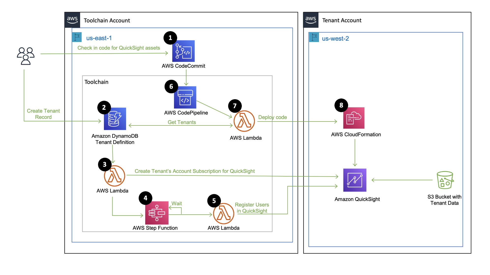

This section details the architecture of this SaaS Solution. Refer [README.md](README.md) for deployment instructions.

- [Overview](#overview)
- [High Level Architecture](#high-level-architecture)
  * [Toolchain Account](#toolchain-account)
  * [Tenant Account](#tenant-account)
  * [CI/CD of QuickSight assets](#ci-cd-of-amazon-quicksight-assets)
- [Conclusion](#conclusion)

# Overview

In Software-as-a-service (SaaS) delivery model, there are scenarios where SaaS providers who offer business analytics solutions, choose to isolate customer (tenant) data in their own S3 buckets and provision separate Quicksight accounts for each tenant to meet their tenant isolation requirements . This tenant isolation strategy where each tenant has its own dedicated set of resources is also called as silo deployment model. Silo deployments provides a simpler way to isolate tenants' compute and storage resources, addressing the noisy-neighbor problem. 

In this sample implementation, we have illustrated how a SaaS provider can automatically create Quicksight subscription for a Tenant in a dedicated Quicksight account during tenant onboarding, and then set up a CI/CD pipeline to automatically push the latest version of Quicksight assets such as Data Source, DataSet, Analysis and Dashboard from source control (example CodeCommit) to each tenant's Quicksight account. This approach allows the SaaS provider to achieve the much-needed operational efficiency in a silo model, by keeping all tenants on a single version of release.

This solution is based on expanded API capabilities that were released during re:invent 2022 (https://aws.amazon.com/about-aws/whats-new/2022/11/amazon-quicksight-expanded-api-capabilities/). These API capabilities allow programmatic access to the underlying structure of QuickSight dashboards and analyses with the AWS Software Development Kit. The new and expanded APIs let customers and developers treat QuickSight assets like software code and integrate with DevOps processes, such as code reviews, audits, and promotion across development and production environments. 

# High Level Architecture

Figure 1 represents the high-level architecture of this sample implementation. The architecture is comprised of logical components; Toolchain account, Tenant account, Tenant onboarding and CI/CD of QuickSight assets (Data Source, Data Set, Analysis, and Dashboard). 

Figure 1: High Level Architecture

## Toolchain Account

Toolchain account is the SAAS provider's account that has components for managing Tenant accounts. In actual Production implementation, you may have more than one account to accomplish this. For simplicity we have everything in one Toolchain account.

  1. Tenant definition in a Amazon DynamoDB. This table has an attribute "ApplyLatestRelease" that will determine if latest code should be deployed to the Tenant account.

  2. Amazon DynamoDB stream that triggeres AWS Lambda function for creating Amazon QuickSight subscription when a new record is inserted in Tenant table in Amazon DynamoDB.

  3. AWS Lambda Functions for creating a Amazon QuickSight subscription in Tenant's account, and for registering Tenant's user in Amazon QuickSight.

  4. AWS Step function (state machine) that orchestrates the initial setup of QuickSight. It is triggered by the lambda that creates QuickSight subscription for a tenant. First state in this State Machine is to wait for Amazon QuickSight to be completely set up in Tenant's account, followed by AWS lambda call to register Tenant user in Amazon QuickSight.

  5. AWS CodeCommit repository where developers/business analysts check-in the CloudFormation script and json documents that capture Amazon QuickSight assets such as Data Source, DataSet, Analysis, and Dashboard.

  6. AWS CodePipeline that listens to CodeCommit repository as source, and calls AWS Lambda function to deploy the latest version of Amazon Quicksight assets in Tenant accounts as defined in DynamoDB. This AWS Lambda function runs Cloudformation in each Tenant account, where attribute "ApplyLatestRelease" as "true". 

  7. A CloudWatch rule that triggers the CodePipeline every 5 minutes. This allows pushing code to newly onboarded Tenant. Close run of CodePipeline every 5 minutes has been created to test the tutorial.  

  8. A CrossAccount management role named "SAASToolChainTenantManagementRole" that will assume a role in Tenant Account. This will allow Toolchain account to do management activities such as make API calls or run CloudFormation templates in Tenant accounts. 

  9. IAM roles for various services used in this solution. **Its important to note that we have not always tightly scoped the IAM permissions to allow for experimentation in this Tutorial. We strongly advice against provided more permissions to IAM roles than necessary in your production workloads.** 

  10. An S3 Bucket with miscellaneous files required for running the tutorial.

## Tenant Account

Tenant account represents a dedicated account (in either same or different region than Toolchain account) for a Tenant. Tenant account has the following components:

  1. S3 Bucket with Tenant's Sales data. This tutorial will stage sample data.

  2. QuickSight for analysing Tenant's data.

  3. A Cross Account IAM role named "SAASTenantManagementCrossAccountRole" to be assumed by Toolchain account for management tasks.

  4. An S3 Bucket with miscellaneous files required for running the tutorial.

## CI CD of Amazon QuickSight Assets

SAAS Developers and Business Analysts can now create DataSources, DataSets, Analysis and Dashboards in their Development account, and then export these assets by leveraging APIs (DescribeDataSource, DescribeDataSet, DescribeAnalysisDefinition, DescribeTemplateDefinition, DescribeDashboardDefinition) into JSON templates. These JSON templates can then be used to automatically create these assets in Tenant Account by leveraging CloudFormation and Custom Lambda. In this sample implementation, we have provided an example CloudFormation template for these assets. **QuickSight_Assets_CI_CD\README.md** file has detailed explanation of how this template was created. You can reuse the code and replicate the process to create templates for your projects.

# Conclusion

This document shared a SaaS siloed business analytics reference solution and should give you a better sense of how the application is built and allow you to more easily navigate the resources in the repository.

We encourage you to dig into the code and provide feedback to help us shape the evolution of this environment. We expect to continue to make enhancements to the solution and address new strategies as they emerge.
