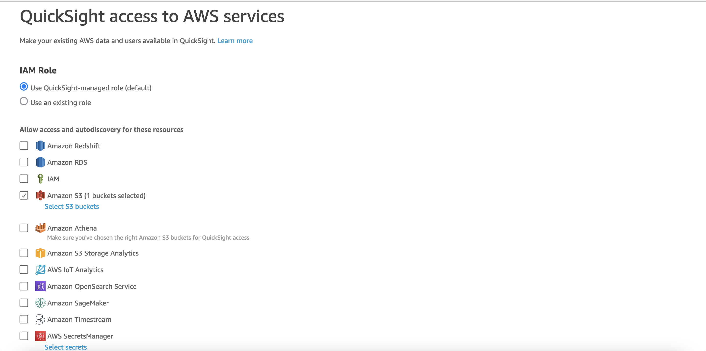

# CI/CD of QuickSight Assets in SaaS Silo deployment model- Reference Solution
**[Documentation](DOCUMENTATION.md)**

## Introduction
In Software-as-a-service (SaaS) delivery model, there are scenarios where SaaS providers who offer business analytics solutions, choose to isolate customer (tenant) data in their own S3 buckets and provision separate Quicksight accounts for each tenant to meet their tenant isolation requirements . This tenant isolation strategy where each tenant has its own dedicated set of resources is also called as silo deployment model. Silo deployments provides a simpler way to isolate tenants' compute and storage resources, addressing the noisy-neighbor problem. 

In this sample implementation, we have illustrated how a SaaS provider can automatically create Quicksight subscription for a Tenant in a dedicated Quicksight account during tenant onboarding, and then set up a CI/CD pipeline to automatically push the latest version of Quicksight assets such as Data Source, DataSet, Analysis and Dashboard from source control (example CodeCommit) to each tenant's Quicksight account. This approach allows the SaaS provider to achieve the much-needed operational efficiency in a silo model, by keeping all tenants on a single version of release.

This implementation contains code (a subset of overall SAAS implementation) required to demonstrate automatic setup and configuration of QuickSight upon Tenant onboarding, and continous deployment of sample QuickSight assets to the Siloed Tenants. For general guidance on how to build SAAS implementation, please refer to another Solution guidance published here: https://github.com/aws-samples/aws-saas-factory-ref-solution-serverless-saas. 

Note that the instructions below are intended to give you step-by-step, how-to instructions for getting this solution up and running in your own AWS account. For a general description and overview of the solution, please see the developer's documentation [here](DOCUMENTATION.md).

## High Level Architecture  
Figure 1 provides a high-level representation of the baseline architecture that will get deployed, once you complete the deployment. As mentioned before, please see the [documentation](DOCUMENTATION.md) to understand the architecture in more detail.

Figure 1: High Level Architecture
 

## Pre-requisites

To follow this tutorial completely, you should have administrator access to two AWS accounts:

**Toolchain Account**: This AWS Account hosts the SAAS provider's toolchain for creating and managing Tenant Accounts. Components that are created in this account include Code Repository, Code Pipeline, Tenant definition DynamoDB hosted database, Lambda functions for setting up QuickSight, registering users, deploying QuickSight assets etc.

Please take note of AWS Account ID for ToolChain Account. We will refer to its value as following in this tutorial: [ToolChain AWS Account ID] 

**Tenant Account**: Dedicated AWS Account that is created for a Tenant. We assume that the AWS Account is already created by a process in Tenant Onboarding outside of this code. 

Please take note of AWS Account ID for Tenant Account. We will refer to its value as following in this tutorial: [Tenant AWS Account ID]

## Setup ToolChain Account

Run the Cloudformation template **Step_1_ToolChain_Account_Setup\ToolChainAccount.yaml** in the ToolChain Account, with following parameters
1. Set value of parameter **TenantAccountId** as [Tenant AWS Account ID] 
2. Use default value (already set in Cloudformation) for all other parameters.

## Validate Toolchain Account
Once the Cloudformation template is successfully deployed, validate that following components are created:

1. A Code Commit Repository named SaasQuickSightAssets. 
Figure 2: CodeCommit Repository

2. A DynamoDB table named SAASTenantDefinition. 
Figure 3: DynamoDB Table with Tenant Definition

3. An IAM role named SAASToolChainTenantManagementRole. This role allows the Toolchain account lambda functions to assume role in Tenant account. If you want to test this solution with multiple Tenant accounts, you need to add following permission for every Tenant account:
        - Effect: Allow
            Action: sts:AssumeRole
            Resource: !Sub
                'arn:aws:iam::${TenantAccountId}:role/SAASTenantManagementCrossAccountRole'
    
Figure 4: Cross Account IAM role for running commands in Tenant Accounts from Toolchain Account

4. Lambda Functions for creating QuickSight subscription, users and QuickSIght assets as they are checked into CodeCommit repository. 
Figure 5: Lambda Functions for QuickSight subscription, initial set-up and CI/CD of QuickSight assets

5. Step Function state machine "SAASTenetQSSetupStateMachine". This state machine has steps to set up QuickSight in Tenant's AWS Account. 
Figure 6: Step Funtion State Machine

6. CodePipeline that has CodeCommit repository "SaasQuickSightAssets" as Source and a Lambda function "DeployCodeToSiloSAASTenantsLambda" that loops through all tenants as defined in DynamoDB "SAASTenantDefinition", and deploys the latest QuickSight code for DataSource, DataSet, Analysis and Dashboard to tenants that have subscribed for the code. 
Figure 7: Code Pipeline for CI/CD of QuickSight assets

7. A CloudWatch rule for triggering CodePipeline every 5 minutes. CodePipeline will iterate through all Tenants configured in DynamoDB, check if the Tenant has subscribed for applying latest changes. If Tenant has subcribed to changes, next step would be to check if deplyed code's CodeCommitId is different than the latest in repository. If it is different, the latest code will be deployed to the Tenant. By configuring CloudWatch rule to start CodePipeline every 5 minutes, we will push QuickSight assets to newly onboarded Tenants as by default, Code Pipeline will only be triggered when developers check in the code. **Note that this is only for to test this tutorial. You can change the interval if you replicate the soution in your production system.** 
Figure 8: CloudWatch rule for starting CodePipeline at regular intervals
 

8. Two S3 Buckets. One for storing Artifacts to be deployed vis CodePipeline. Second for keeping temporary files needed for this solution to work. One such file is latest boto3 lambda layer to be added to every lambda in this solution. Doing so ensures that latest version of boto3 is used. 
Figure 9: S3 Buckets
 

## Setup Tenant Account

Run the Cloudformation template **Step_2_Tenant_Account_Setup\TenantAccount.yaml** in the Tenant Account, with following parameters
1. Set value of parameter **ToolChainAccountID** as [ToolChain AWS Account ID] 
2. Use default value (already set in Cloudformation) for all other parameters.

## Validate Tenant Account
Once the Cloudformation template is successfully deployed, validate that following components are created:

1. S3 Bucket with Tenant Business Sales Data. Since this is a tutorial, a sample Saas-Sales.csv will be auomatically uploaded in this foler. The second S3 bucket has miscellaneous files needed to run this tutorial. 
Figure 4: Cross Account IAM role for running commands in Tenant Account from Toolchain Account

2. An IAM role named SAASToolChainTenantManagementRole. This role allows the Toolchain account lambda functions to assume role in Tenant account. 
Figure 4: Cross Account IAM role for running commands in Tenant Account from Toolchain Account

## Test the deployment

1. Log in to the **Toolchain account console**. Search for DynamoDB service. 
    
    Run the following script in DynamoDB table "SAASTenantDefinition". You can run the script in PartiQL editor after replacing values starting with 'ENTER VALUE HERE' with values for the Tenant account:

        INSERT into SAASTenantDefinition value {  
            'TenantID' : 'Tenant1',
            'AWSAccountID': 'ENTER VALUE HERE [Tenant AWS Account ID]',
            'AWSRegion' : 'ENTER VALUE HERE [Tenant Account AWS Region]',
            'TenantName': 'SAAS-Customer-1',
            'QSAdminUserEmail': 'ENTER VALUE HERE [Tenant Admin User email address]',
            'QSAdminUserPhone' : 'ENTER VALUE HERE [Tenant Admin User phone]',
            'QSAdminUserFirstName' : 'ENTER VALUE HERE [Tenant Admin User first name]',
            'QSAdminUserLastName' : 'ENTER VALUE HERE [Tenant Admin User last name]',
            'CodeCommitId' : '',
            'ApplyLatestRelease': 'false'
        } 

    
Figure 9: Tenant Onboarding
 

    Adding a new Tenant record will trigger the Lambda function "SAASTenetOnboardingQSSetUpLambda" which will create QuickSight subscription for the new Tenant in Tenant AWS account, and then start the state machine for creating a user in QuickSight.

2. In a separate browser, log into the **Tenant AWS Account console**. Search for "QuickSight". You will be presented with a screen to log in using the email address. Enter the email address of the Tenant Admin User, that was provided in script above. 
Figure 10: QuickSight Log In
 

3. Right click on the icon on top right corner (as shown in image). In the menu that is presented, click on "Manage QuickSight". 
Figure 11: Manage QuickSight

4. In the screen that opens up, click on "Manage Users" in left menu. In the list of users, you should see the Admin User within 4 minutes of DynamoDB reccord insert. Click on "Resend Invitation" next to Admin User. 
Figure 12: Send Email Invitation to Admin User

5. Once email invitation arrives in Admin User's mailbox, accept invitation and set up password. 

6. Come back to the QuickSight management screen. Click on "Security & permissions" on left side menu. In the screen that opens up, click on "Manage" as shown below. 
Figure 13: Manage QuickSight Security

7. Select S3 in the list of services. Then click on "Select S3 Buckets" and select the **tenant-saas-data-[Tenant AWS Account ID]-[Tenant Account AWS Region]** bucket. 
Figure 14: Select S3 Bucket

8. In the **Toolchain account console**, Run the following script in DynamoDB table "SAASTenantDefinition". You can run the script in PartiQL editor after replacing values starting with 'ENTER VALUE HERE' with values for the Tenant account:

        update SAASTenantDefinition set ApplyLatestRelease = 'true' where TenantID = 'Tenant1' and AWSAccountID = '[Tenant AWS Account ID]'
    
    Adding a new Tenant record will mark the Tenant for eligible for CI/CD of QuickSight Data Source, DataSet, Analysis, and Dashboard. Lambda function "DeployCodeToSiloSAASTenantsLambda" which gets triggered by CodePipeline deplys the code.

9. Open CloudFormation in Tenant account. You should see a new stack deployed. 
Figure 11: New CloudFormation stack deployed - stack-Tenant1

10. Open QuickSight management screen in **Tenant account**. Click on "Manage Assets" in left menu. 
Figure 11: Click on QuickSight Assets

11. You should see following assets deployed:

    * SAAS-DataSourceSAAS-Customer-1v1
    * SAAS-DataSetSAAS-Customer-1v1
    * SAAS-DataAnalysisSAAS-Customer-1v1
    * SAAS-DashboardSAAS-Customer-1v1

Figure 11: QuickSight Assets

## Steps to Clean-up

1. Delete the CloudFormation template in Toolchain account 
2. Delete both CloudFormation templates in Tenent account. If Delete fails for stack-Tenant1 stack, force delete it.
3. Open QuickSight in Tenant Account. Click on "Manage QuickSight" screen. In left Menu, click on "Account Settings".
4. Click on Manage. 
Figure 11: QuickSight Manage Account

5. In screen that comes up, toggle button for "Account termination protection is on" to off. Delete QuickSight account.

## License
This library is licensed under the MIT-0 License. See the LICENSE file.

## Security
See [CONTRIBUTING](CONTRIBUTING.md#security-issue-notifications) for more information.
